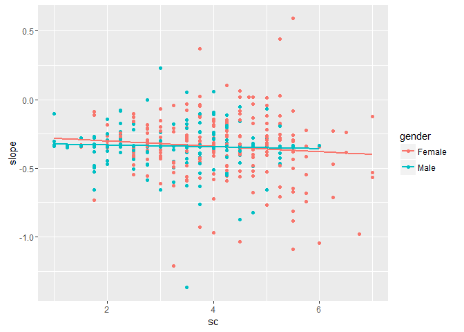
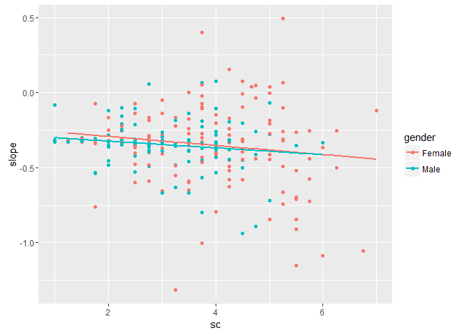
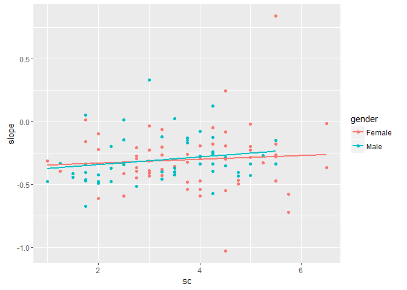
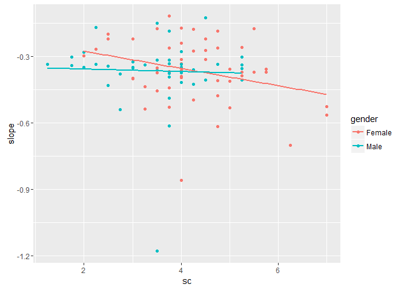
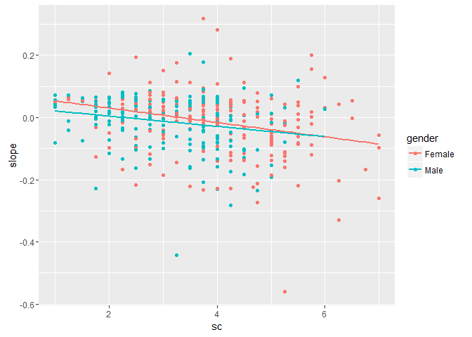
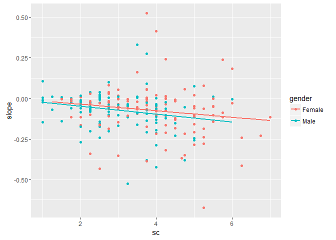
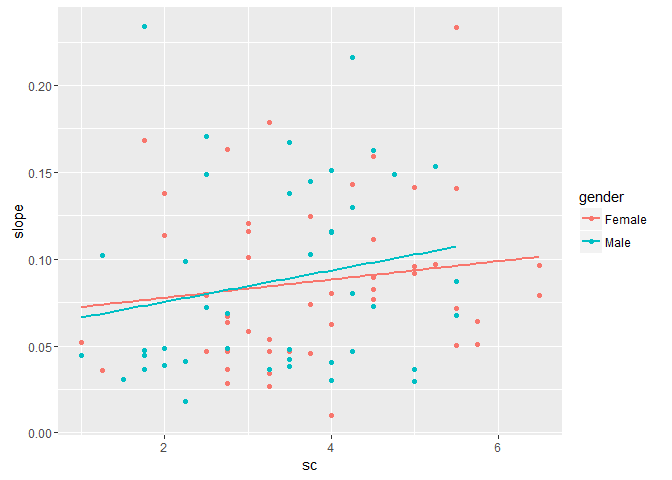
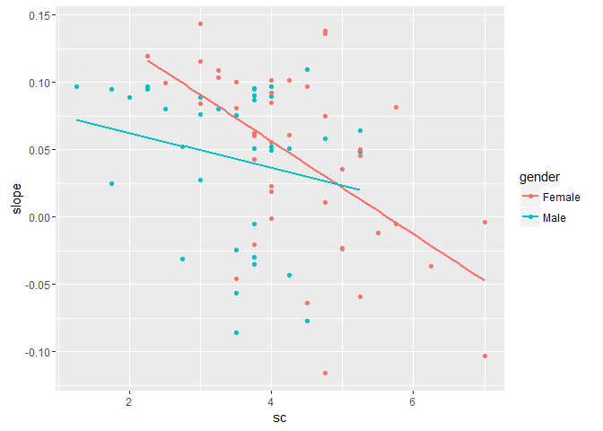

slope\_anlayses\_summary
================
William Hall
December 1, 2016

Stigma consciousness predicting social identity reactance during conversations with men.
----------------------------------------------------------------------------------------

### Overall

| term        |  estimate|  std.error|  statistic| p.value   |
|:------------|---------:|----------:|----------:|:----------|
| (Intercept) |     -0.26|       0.04|      -6.62| &lt; .001 |
| sc          |     -0.02|       0.01|      -2.02| .044      |
| gender      |     -0.06|       0.06|      -0.99| .323      |
| sc:gender   |      0.01|       0.02|       0.85| .394      |

#### Simple slopes

| gender\_id | term |  estimate|  std.error|  statistic| p.value |
|:-----------|:-----|---------:|----------:|----------:|:--------|
| female     | sc   |     -0.02|       0.01|      -2.02| .044    |
| male       | sc   |     -0.01|       0.01|      -0.56| .575    |

### Split by study

| data\_id | term        |  estimate|  std.error|  statistic| p.value   |
|:---------|:------------|---------:|----------:|----------:|:----------|
| ees      | (Intercept) |     -0.23|       0.06|      -3.87| &lt; .001 |
| ees      | sc          |     -0.03|       0.01|      -2.03| .043      |
| ees      | gender      |     -0.05|       0.09|      -0.56| .578      |
| ees      | sc:gender   |      0.01|       0.02|       0.33| .744      |
| gss      | (Intercept) |     -0.36|       0.09|      -4.06| &lt; .001 |
| gss      | sc          |      0.02|       0.02|       0.67| .503      |
| gss      | gender      |     -0.04|       0.13|      -0.34| .736      |
| gss      | sc:gender   |      0.02|       0.03|       0.45| .653      |
| hws      | (Intercept) |     -0.20|       0.08|      -2.37| .020      |
| hws      | sc          |     -0.04|       0.02|      -2.04| .044      |
| hws      | gender      |     -0.15|       0.12|      -1.26| .209      |
| hws      | sc:gender   |      0.03|       0.03|       1.13| .261      |

#### Simple slopes

| gender\_id | data\_id | term |  estimate|  std.error|  statistic| p.value |
|:-----------|:---------|:-----|---------:|----------:|----------:|:--------|
| female     | ees      | sc   |     -0.03|       0.01|      -2.03| .043    |
| male       | ees      | sc   |     -0.02|       0.02|      -1.21| .229    |
| female     | gss      | sc   |      0.02|       0.02|       0.67| .503    |
| male       | gss      | sc   |      0.03|       0.03|       1.19| .239    |
| female     | hws      | sc   |     -0.04|       0.02|      -2.04| .044    |
| male       | hws      | sc   |     -0.01|       0.02|      -0.25| .803    |

### Plots

#### Overall

\[\[1\]\] 

#### By study

##### EES

\[\[1\]\] 

##### GSS

\[\[1\]\] 

##### HWS

\[\[1\]\] 

Stigma consciousness predicting social identity reactance during conversations with women
-----------------------------------------------------------------------------------------

### Overall

| term        |  estimate|  std.error|  statistic| p.value   |
|:------------|---------:|----------:|----------:|:----------|
| (Intercept) |      0.08|       0.02|       3.68| &lt; .001 |
| sc          |     -0.02|       0.01|      -4.56| &lt; .001 |
| gender      |     -0.04|       0.03|      -1.34| .180      |
| sc:gender   |      0.01|       0.01|       0.83| .410      |

#### Simple slopes

| gender\_id | term |  estimate|  std.error|  statistic| p.value   |
|:-----------|:-----|---------:|----------:|----------:|:----------|
| female     | sc   |     -0.02|       0.01|      -4.56| &lt; .001 |
| male       | sc   |     -0.02|       0.01|      -2.69| .007      |

### Split by study

| data\_id | term        |  estimate|  std.error|  statistic| p.value   |
|:---------|:------------|---------:|----------:|----------:|:----------|
| ees      | (Intercept) |      0.00|       0.04|       0.11| .909      |
| ees      | sc          |     -0.02|       0.01|      -2.10| .037      |
| ees      | gender      |      0.00|       0.05|      -0.06| .955      |
| ees      | sc:gender   |      0.00|       0.02|      -0.29| .771      |
| gss      | (Intercept) |      0.07|       0.02|       2.97| .004      |
| gss      | sc          |      0.01|       0.01|       0.93| .353      |
| gss      | gender      |     -0.01|       0.03|      -0.31| .756      |
| gss      | sc:gender   |      0.00|       0.01|       0.45| .656      |
| hws      | (Intercept) |      0.19|       0.04|       5.37| &lt; .001 |
| hws      | sc          |     -0.03|       0.01|      -4.27| &lt; .001 |
| hws      | gender      |     -0.11|       0.05|      -2.08| .041      |
| hws      | sc:gender   |      0.02|       0.01|       1.68| .098      |

#### Simple slopes

| gender\_id | data\_id | term |  estimate|  std.error|  statistic| p.value   |
|:-----------|:---------|:-----|---------:|----------:|----------:|:----------|
| female     | ees      | sc   |     -0.02|       0.01|      -2.10| .037      |
| male       | ees      | sc   |     -0.02|       0.01|      -2.06| .041      |
| female     | gss      | sc   |      0.01|       0.01|       0.93| .353      |
| male       | gss      | sc   |      0.01|       0.01|       1.43| .157      |
| female     | hws      | sc   |     -0.03|       0.01|      -4.27| &lt; .001 |
| male       | hws      | sc   |     -0.01|       0.01|      -1.30| .196      |

### Plots

#### Overall

\[\[1\]\] 

#### By study

##### EES

\[\[1\]\] 

##### GSS

\[\[1\]\] 

##### HWS

\[\[1\]\] 
